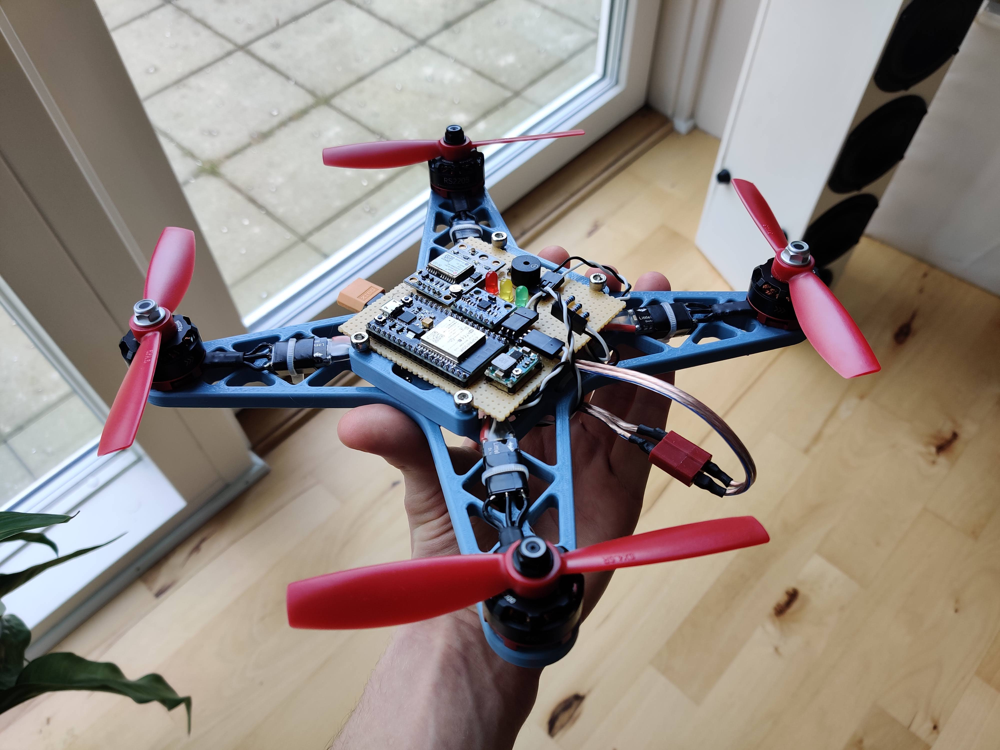

# Project quad

This git repository is a personal project of mine to develop an autonomous quad copter using cheap off-the-shelf components in conjunction with control theory and state estimation algorithms.

## Primary topics
- [Design philosophy and 3D models](/3dparts/README.md)
- [Modelling of drone](/docs/README.md)
- [Autonomous drone regulation](docs/autonomous_drones.md)
- [Design of main PCB](/hardware/README.md)

<!--  -->

---

## Directory contents

- **[3dparts](/3dparts/README.md)** - 3D models used in the project as STEP and .obj files.
- **[docs](/docs/README.md)** - Documentation and learning material used in the project.
- **[hardware](/hardware/README.md)** - Schematics, and PCB layouts as well as finished gerber files.
- **[images](/images/README.md)** - Photos used in readme and some documentation.
- **[software](/software/README.md)** - Software related to the project, including simulations, firmware, etc.
- **[tests](/tests/README.md)** - Results from test conducted during this project

---

## Disclaimer

I do not hold any responsibility for what another person does with the information or content provided in this repository. The repository is provided as-is with no guarentee agains personal or material damage. Everything here should be considered experimental, so please be responsible, but please lean as much as possible while you are browsing around. 