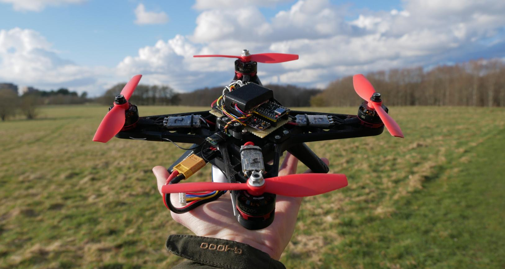

# Project quad

This git repository is a personal project of mine to develop an open-source autonomous quad copter using cheap off-the-shelf components in conjunction with control theory and state estimation. As much as possible, any auxiliary tools and documentation I produce, will also be a part of the repository.

## Getting Rusty

The [firmware](/software/rusty-quad) is written in the Rust programming language. This is in contrast to most flight controllers (and embedded devices in general) which use C or C++. The reason for choosing Rust is quite simple: it is a modern language. It can guarantee many things about the validity of memory at compile time, allows for writing high-level code, that runs at low-level speeds, and feels good to write; once you become friendly with the borrow checker.

### [*YouTube* : Demo of wireless data plotting and responsive controls](https://www.youtube.com/watch?v=jQ53PiUz8Us)

---

## Directory contents

- **[3dparts](/3dparts/)** - 3D models used in the project as STEP and .obj files.
- **[docs](/docs/)** - Documentation and learning material used in the project.
- **[hardware](/hardware/)** - Schematics, and PCB layouts as well as finished gerber files.
- **[images](/images/)** - Photos used in readme and some documentation.
- **[software](/software/)** - Software related to the project, including simulations, firmware, etc.
- **[tests](/tests/)** - Results from test conducted during this project

---

## Related repositories

During this project, some additional tools were developed, that reside in their own repositories.

### Rust crates

- [Async no-std ICM-20948 driver](https://github.com/peterkrull/icm20948-async)
- [RP2040 PIO quad Dshot driver](https://github.com/peterkrull/quad-dshot-pio)
- [Magnetometer calibration algorithm](https://github.com/peterkrull/mag-calibrator-rs)
- [Linear multi-sensor Kalman filter](https://github.com/peterkrull/kalman_filter_rust/)
- [(Forked) no-std SBUS-parser](https://github.com/peterkrull/sbus)

---

## License

This work is licensed under GPLv3.