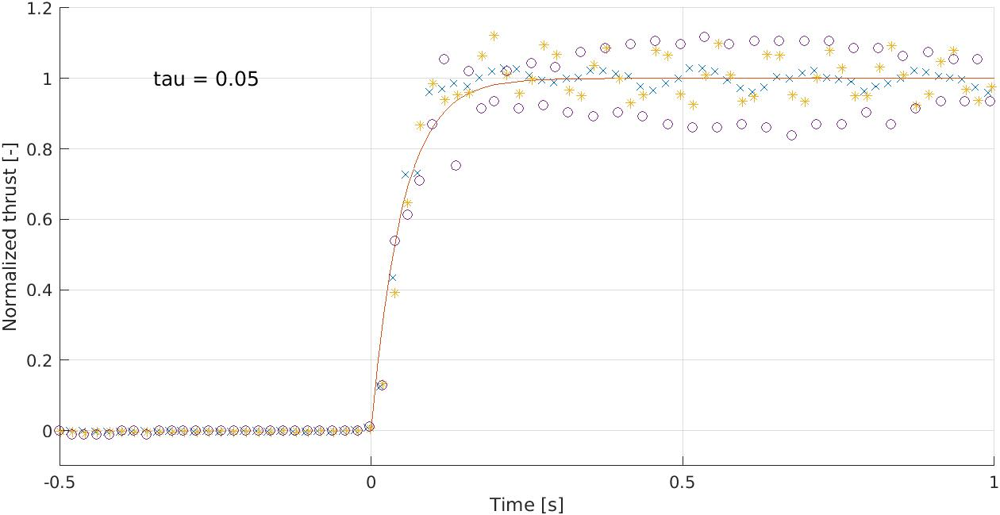

# Determining the time constant of a step in thrust

For this test, it is assumed that the thrust come-up of the motor + esc can be approximated as a first order model. Additionally, it is expected that the time constant is the same for any step-increase in thrust, just like the ideal motor model, but this will be verifed during the test.

---

## Test setup and procedure

The thrust is measured in grams at 50 Hz using a strain guage of the type [Eilersen SPSX](https://www.eilersen.com/single-point-load-cell/product/single-point-load-cell-spsx/) in combination with the [Eilersen 4X79A](https://www.eilersen.com/analog-weighing-module/product/analog-output-module-4x79a/) digital readout module, connected to a computer via ethernet, and read using a [program](/software/misc_tools/TCP_strain_guage.py) that establishes and logs a TCP data stream. A single motor with propeller is rigidy mounted to the strain guage using [3D-printed parts](/3dparts/teststand_thrust/) and driven by a 30 A DShot ESC and a 4S Li-Po battery charged to 15.82 V.

A [firmware](/software/ESP32_thrust_step_firmware/src/main.cpp) has been written for the ESP32-based flight controller that enables a step to be commanded from a computer via the USB connection to the ESP32.

---

## Results

Three tests were performed, where the motor went from a DShot command of 100 to [500](/tests/0500_thrust_response.csv), to [1200](/tests/1200_thrust_response.csv), and finally to [1500](/tests/1500_thrust_response.csv). These are analyzed using a [Matlab script](/software/misc_tools/plotting_thrust_steps.m), where the step is set to happen at $t = 0$ as well as have steady-state gain of around $1$. An exponential function of the form $G(t)=1-e^{-\frac{t}{\tau}}$ is fitted to the data, where $\tau$ denotes the time constant of the first order system. It is determined for all three tests, that $\tau = 50 \text{ ms}$ is a good fit, striking a middle ground for any deviance there might be between them.

