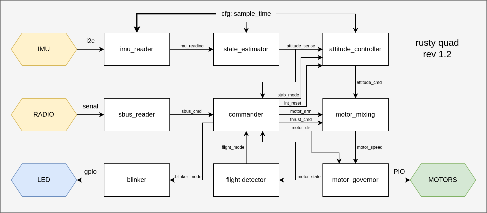

# Firmware Architechture

This document seeks to describe the high-level design of the [flight controller](/software/rusty-quad/), written in Rust around the [Embassy](https://embassy.dev/) framework. This document will not go into depth with anything specific to the implementation (that is, no Rust code is shown), but the design will rely on some of the syncronization primitives provided by the Embassy framework.

## Message passing

The firmware makes great use of the async functionality provided by Embassy. This includes splitting the logic into a bunch of small self-contained programs, realized via Embassy `tasks`. The firmware therefore also relies heavily on message passing, usually via the `PubSubChannel` type, to allow for multiple receivers of the same message.

The firmware archtechture is described by the the diagram below.



The architechture is arguably overkill given the current set of functionality, but it should *hopefully* make it easier to add more functionality down the road.

## Task signature structure

Each task signature must follow a clear set of rules, such that input/output relations are more easily reasoned. Take the example signature below. Inputs are clearly listed first, and outputs last. Additionally, the type of the signals are defined in a crate module called `signals`, such that everything relating to these signals, including the type of data and the number of receivers are contained in a single file.

```rust
use crate::signals;

#[embassy_executor::task]
pub async fn controller(
    in_enable:       signals::ConEnableSub,
    in_setpoint:     signals::ConSetpointSub,
    in_measurement:  signals::ConMeasurementSub,
    out_output:      signals::ConOutputPub,
) { ... }
```

The `PubSubChannel` channel type also allows for multiple senders, and queueing of data. These use cases are however not utilized in this project as of yet.

Each signal is defined by the number of receivers (subscribers), as well as the type of data within it. For example, the `ConEnableSub` signal from the example above could be defined like this.

```rust
const CON_ENABLE_NUM: usize = 1;
pub type ConEnableType = bool;
pub type ConEnablePub = Pub<ConEnableType,CON_ENABLE_NUM>;
pub type ConEnableSub = Sub<ConEnableType,CON_ENABLE_NUM>;
pub static CON_ENABLE : Ch<ConEnableType,CON_ENABLE_NUM> = PubSubChannel::new();
```
